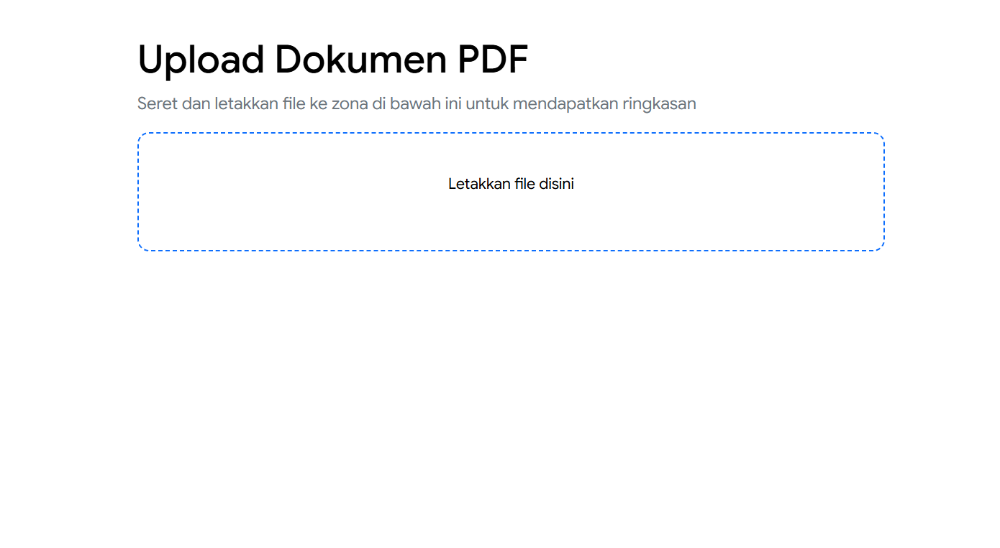
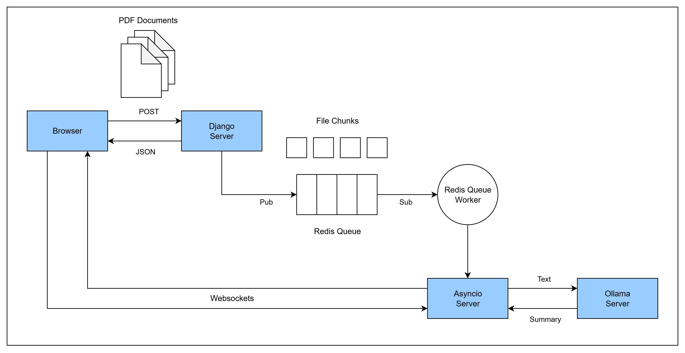

# PDF Document Summarizer



A simple prototype web application that leverages a fine-tuned **Large Language Model (LLM)** to provide structured summaries and insights from PDF documents specifically for Indonesian National Military. This project was developed as a task for my internship at [Ciheul Technologies](https://www.ciheul.com/).


## ✨ Main Feature

* **Multi-File Upload:** Upload multiple PDF files simultaneously with a modern drag-and-drop interface
* **Chunking-Based File Upload:** Break large files into smaller chunks for reliable and efficient uploads
* **Asynchronous Processing:** Uses **Python RQ** and **Redis** to handle heavy processing (text extraction & LLM) in the background without blocking the user interface
* **Real-Time Notification:** Provides real-time status updates and summary results to users using **WebSockets**
* **AI Summarization:** Uses a fine-tuned LLM **Gemma3** to analyze text and provide accurate structured summaries


## 🏛️ System Architecture

The application is built on a distributed microservices architecture, separating frontend, backend, and AI processing tasks.



**System Workflow**

This process outlines how users can upload PDF files, which are then processed to extract and summarize their text. Key points: 

1. Users can drag and drop PDF files into a designated area on the web page, where client-side **JavaScript** splits the files into 1MB chunks
2. Each chunks are sent to a **Django** API, which creates jobs for each chunk and queues them in **Redis**
3. **RQ Worker** processes these jobs, storing the chunks and merging them into one PDF when finished
4. **Asyncio server** listens for messages from Redis, extracts text from the PDF, and send it to the user's browser via **WebSocket** connection alongside the initial prompt for summarization
5. User allowed to edit the prompt before sending it to an LLM on **Ollama** for a summary. The summary then sent back to the user's browser for display

This system allows for efficient PDF uploading, processing, and summarization through real-time updates to the user's browser.


## 🛠️ Tech Stack

* **Frontend:** HTML, CSS, VanillaJS
* **Backend:** Django, Django Channels, Python RQ (Redis Queue)
* **Real-Time Communication:** WebSockets, Asyncio
* **Database & Queues:** PostgreSQL, Redis
* **AI / Machine Learning:** Ollama, Unsloth, PyTorch, Gemma3 (Fine-Tuned)
* **Environment:** WSL (Windows Subsystem for Linux)


## 🚀 How To Run

**Prerequisites:**
* Python 3.10+
* Django
* Redis
* PostgreSQL
* Ollama
* Linux/WSL


**Steps:**
1.  **Clone repository:**
    ```bash
    git clone https://github.com/dzakyatha/pdf-document-summarizer.git
    cd pdf-document-summarizer
    ```
2.  **Setup Virtual Environment dan Install Dependencies:**
    ```bash
    python3 -m venv venv
    source venv/bin/activate
    pip install -r requirements.txt
    ```
3.  **Run Supporting Services:**
    Ensure Redis, PostgreSQL, and Ollama are running.

4.  **Run the Application Servers (in a separate terminal):**
    ```bash
    # Terminal 1: Django Server
    python manage.py runserver

    # Terminal 2: RQ Worker
    python manage.py rqworker default

    # Terminal 3: Asyncio WebSocket Server
    python asyncio_server.py
    ```
5.  Open `http://127.0.0.1:8000` in browser
